# Integrating Azure Functions with .NET Aspire: Web-Queue-Worker Architecture

This project demonstrates how to integrate **Azure Functions** with **.NET Aspire**, showcasing a **Web-Queue-Worker** architecture style. It modified the default QuickStart template.  

## 🧭 Configurations

1. The project uses the **Queue**, **Redis**, and **Cosmos DB**. These are automatically initialized by .NET Aspire

2. Update `appsettings.sample.json` and `local.settings.sample.json` with your values.

3. To get started:
   - Open the solution in **Visual Studio**.
   - Right-click the `AppHost` project in **Solution Explorer**.
   - Select **'Set as Startup Project'**.
   - Press `F5` (or `Ctrl + F5` to run without debugging) to launch the app.

4. Once running, the **.NET Aspire dashboard** will open in your browser:

   

5. **.NET Aspire WebFrontend**

   

## References & Resources

- [.NET Aspire Quickstart: Build your first app](https://learn.microsoft.com/en-us/dotnet/aspire/get-started/build-your-first-aspire-app)  
- [YouTube: Azure Function with .NET Aspire](https://www.youtube.com/watch?v=g-fKXzrNOhI)  
- [Web-Queue-Worker Architecture Style](https://learn.microsoft.com/en-us/azure/architecture/guide/architecture-styles/web-queue-worker)  
- [CosmosDB Emulator Authentication](https://learn.microsoft.com/en-us/azure/cosmos-db/emulator#authentication):  
   `AccountEndpoint=https://localhost:8081/;AccountKey=<AccountKey>;`
- [Azurite Emulator Queue Connection String](https://learn.microsoft.com/en-us/azure/storage/common/storage-use-azurite):  
   In `appsettings.json`: `"UseDevelopmentStorage=true"`
- [.NET Aspire + Azure Queue Storage Integration](https://learn.microsoft.com/en-us/dotnet/aspire/storage/azure-storage-queues-integration)
- [.NET Aspire + Azure CosmosDB Integration](https://learn.microsoft.com/en-us/dotnet/aspire/database/azure-cosmos-db-integration)

## Sequence Diagram: Web → Queue → Worker

```mermaid
sequenceDiagram
    participant User
    participant Web as Web Frontend
    participant API as API Service
    participant Queue as Azure Queue ⟳
    participant Worker as Azure Function Worker 👷
    participant Cache as Redis Cache 🔄
    participant DB as Cosmos DB 🗄️

    User->>Web: Submit request
    Web->>API: Forward request
    API->>DB: Save request history (Status: Pending)
    API->>Queue: Send message with request ID
    Note over Queue: Message contains RequestHistory JSON
    
    Queue-->>Worker: Trigger QueueProcessor function
    Worker->>Worker: Deserialize message
    Note over Worker: Process the request
    Worker->>DB: Update status to "Completed"
    DB->>Cache: Store in cache (request:{id})
    DB->>Cache: Invalidate user request list cache
    
    User->>Web: Check request status
    Web->>Cache: Try get from cache (requests)
    alt Cache hit
        Cache-->>Web: Return cached data
    else Cache miss
        Web->>DB: Query all request history
        DB-->>Web: Return request history
        Web->>Cache: Cache result (requests)
    end
    Web-->>User: Display all requests
```

